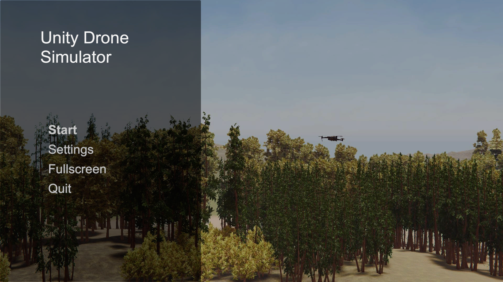

# drone versus drone

Unity Drone Simulator is an appllcation which allows you to simulate the 'Eagle Concept', streaming out the Camera feed of the 'Hunter' Drone and receiving inputs to move the 'Hunter Drone'. This project is meant to test the capabilities of a Computer Vision Model and PID Controller Script.

## Eagle Concept

A 'Hunter' Drone is flying above the 'Target' Drone, with its camera facing down. The height between the 2 drones is the Separation Distance of the drones. The Hunter Drone's height is fixed at 55m, while adjusting the Separation Distance will move the Target Drone's vertical position. For example, with a Separation Distance of 20m, the Target Drone will be placed at 35m.

In this application, the user is looking from the Hunter Drone's Camera's Point of View, and is able to move the Target Drone with Keyboard Controls (WASD).

## Settings and Configurations
---
### RTSP Settings

The application is able to stream out the Hunter Drone's camera feed via RTSP using FFmpegOut. For more information on FFmpegOut, do refer to the [FFmpegOut README](unity/drone/Assets/FFmpegOut/README.md) or [the GitHub repository](https://github.com/keijiro/FFmpegOut).

> **⚠️Warning!⚠️** Ensure that a server is running before starting the RTSP stream. This repository does **not** come with a RTSP server, consider using [rtsp-simple-server](https://github.com/aler9/rtsp-simple-server) to run the server.

Adjust the **Port Number** and **URL** for the RTSP output path. By default, Port Number is `8554` and URL is `/drone`. The application will display a list of IP Address your device is connected to. This RTSP stream can then be accessed from another device by connecting to a listed IP Address.

> Ensure that the two devices are able to connect to each other, e.g. change firewall settings.

An additional **Delay** can be introduced into the RTSP stream by adjusting the slider in the Settings page. Select how much to delay the stream in milliseconds.
> Note that this will not account for the existing latency, meaning that with a base latency of `500ms`, adding `1000ms` delay will result in a combined delay of `1500ms`.

Click to toggle the **Timestamp**, which will show the time elapsed since the application was opened.
> Note that this Timestamp, located in the bottom left of the screen, will be visible in the RTSP stream. This is useful for measuring latency between the application and the receiving client.

If necessary, adjust the other parameters for the stream:
- **Width** (default 1920),
- **Height** (default 1080), 
- and **Frame Rate** (default 30).

### ZeroMQ Settings

The application is able to receive inputs via ZeroMQ, to move the Hunter Drone. The Controller Script should send in inputs as `Vx,Vy`. 
> `Vx` and `Vy` should be within the range from -1 to 1.

Enter the **Path** for the application to connect and listen to.

A **Delay** can also be introduced, meaning that inputs will only be executed a set fixed time after receiving from the Controller Script.
> Similar to the RTSP delay, this will not account for the existing latency.

### Drone Settings

Modify the Settings for both the Hunter Drone and the Target Drone.

As mentioned in [Eagle Concept](#eagle-concept), **Separation Distance** will adjust the height of the Target Drone from the Hunter Drone, from a range of 1m to 50m.

The **Max Speed** of the Hunter Drone and the Target Drone can be adjusted. This will determine how fast the drones will travel. For example, with `Vx = 0.5` and **Max Speed** of `10m/s`, the drone will move at `5m/s`.

The 3D Model for the Target Drone can also be changed. This repository comes with the models of DJI Mavic and DJI Phantom. New models can also be imported by placing them into the `Assets/Resources/Drone Models` folder, as well as the `StreamingAssets/Drone Models` folder. 

During runtime, models can be imported through the `StreamingAssets/Drone Models` folder. Supported formats are:
- obj
- glTF

The Refresh Button next to the Model Dropdown will reload all the files and import the models. For more info on the Runtime Importers, refer to the [Assets README on Runtime Importers](unity/drone/Assets/README.md#runtime-importers).

The Target Drone's **Material Colour** can also be edited using the Flexible Color Picker. For more info on the Flexible Color Picker, refer to the [Assets README on the Flexible Color Picker](unity/drone/Assets/README.md#flexible-color-picker-v250) or the [FlexibleColorPickerDoc.pdf](unity/drone/Assets/FlexibleColorPicker/FlexibleColorPickerDoc.pdf).